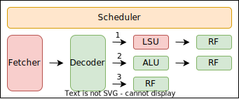

# MINIGPU Project Overview
MINIGPU is an exploration of the basic underlying architecture in a GPU and is a simple hardware RTL implementation of a singular Streaming Multiprocessor Unit. 

Much of the architecture within this project is based off the MIAOW GPU whitepaper which is an open source hardware implementation of a GPU along with Adam Maj's implementation of tiny-gpu. 

Reference Links & Sources:

- https://github.com/adam-maj/tiny-gpu/tree/master?tab=readme-ov-file
- https://miaowgpu.org/

**Table Of Contents**

- [MINIGPU Project Overview](#minigpu-project-overview)
  - [Introduction](#introduction)
  - [File Organization](#file-organization)
  - [Architecture Overview](#architecture-overview)
    - [GPU Level Block Diagram](#gpu-level-block-diagram)
    - [Compute Unit Block Diagram](#compute-unit-block-diagram)
    - [Thread Operation Overview](#thread-operation-overview)
    - [Modules Overview](#modules-overview)
  - [Handshaking Protocol Overview](#handshaking-protocol-overview)
  - [ISA Overview](#isa-overview)
      - [ADD](#add)
      - [SUB](#sub)
      - [MUL](#mul)
      - [DIV](#div)
      - [BNE](#bne)
      - [BEQ](#beq)
      - [BLT](#blt)
      - [BGT](#bgt)
      - [CONST](#const)
      - [LW](#lw)
      - [SW](#sw)
      - [NOP](#nop)
      - [JR](#jr)
  - [Testing](#testing)
    - [Vector-Vector Add Test](#vector-vector-add-test)
    - [Matrix Multiplication Test](#matrix-multiplication-test)
  - [Next Steps](#next-steps)


## Introduction

Much of the actual architecture wtihin modern GPUs remain largely restricted to the public, however the foundational architecture utilized in this project is roughly similar. In CPU land, the multistage pipelined processor is often taught and built off as the baseline model for understanding CPUs and basic computer architectural principles, however when searching for similar models with respect to GPUs, resources and models like that were hard to come across which inspired me to explore and create a simple model to better understand how GPUs work. 

For the MINIGPU's implementation, a very small custom ISA was created to provide sufficient instruction breadth to accomodate two desired functionalities of this minigpu: Vector-Vector Addition and Matrix-Matrix Multiplication. More details on the ISA are described in later sections. 

A bottom up approach to create MINIGPU was taken, first starting off with smaller submodule blocks interleaved with various cases of unit testing and working my way up towards top level integration and coroutine simulation testing. For this project, ``` icarus verilog ``` and ``` cocotb ``` were used as the main verilog compiler and coroutine simulations. For file development, the standard 2005 verilog was followed. This project is my first time working with these two frameworks which may explain some rudimentary design choices made in earlier files. For debugging, ```gtkwave``` was used to expand and dump vcd files to view specific wires and registers. 

## File Organization 

This directory is organized into several subdirectories for ease of organization. Irrelavant files are removed from the diagram below. The choice of having /wrapper and creating wrapper files is to simply abstract debugging wires from the actual verilog files corresponding to module implementations.

```
src
   |-- alu
   |   |-- alu.v
   |-- controllers
   |   |-- data_control.v
   |   |-- inst_control.v
   |-- cu
   |   |-- cu.v
   |-- decoder
   |   |-- decoder.v
   |-- dispatcher
   |   |-- dispatcher.v
   |-- fetcher
   |   |-- fetcher.v
   |-- gpu
   |   |-- gpu.v
   |-- lsu
   |   |-- lsu.v
   |-- pc
   |   |-- pc.v
   |-- rf
   |   |-- xblock_rf.v
   |-- scheduler
   |   |-- scheduler.v
test
   |-- alu_test
   |   |-- alu_manual_test.v
   |   |-- alu_test.py
   |-- cu_test
   |   |-- cu_test.py
   |-- datacontrol_test
   |   |-- datacontrol_test.py
   |-- decoder_test
   |   |-- decoder_test.py
   |-- dispatcher_test
   |   |-- dispatcher_test.py
   |-- fetcher_test
   |   |-- fetcher_test.py
   |-- gpu_test
   |   |-- gpu_test.py
   |-- instcontrol_test
   |   |-- instr_test.py
   |-- lsu_test
   |   |-- lsu_test.py
   |-- monitors
   |   |-- data_mem.py
   |   |-- inst_mem.py
wrapper
   |-- alu
   |   |-- wrapper_alu.v
   |-- controller
   |   |-- wrapper_datacont.v
   |   |-- wrapper_instcont.v
   |-- cu
   |   |-- wrapper_cu.v
   |-- decoder
   |   |-- wrapper_decoder.v
   |-- dispatcher
   |   |-- wrapper_dispatcher.v
   |-- fetcher
   |   |-- wrapper_fetcher.v
   |-- gpu
   |   |-- wrapper_gpu.v
   |-- lsu
   |   |-- wrapper_lsu.v
```

## Architecture Overview

GPUs can be viewed as essentially SIMT processing units, which stands for Single Instruction Multiple Threads where a single instruction is shared amongst multiple threads enabling a massive throughput of instruction processes. As a result, vectorized computations are much more efficient when using GPUs and in modern GPU architecture, a fairly expansive set of operations are supported within a single Streaming Multiprocessor unit. 

However, for the sake of simplicity and foundational understanding, much of the modern advanced architectures within GPUs are ommitted in MINIGPU including things such as: 

1. Wavepool Scheduling: This can be thought of as trying to efficiently organize and run specific threads of instructions in order to maximize overall GPU efficiency. In CPU land, this can be roughly viewed as pipelining instructions. 
2. Branch Divergence: This concept relates to the one above, but if we have two consecutive warps each with 16 threads and say half of the first warp takes "Branch A" and the rest "Branch B", while the second warp does the same thing, the wavepool scheduler can re-organize which threads belong to which warp to essentially minimize the overall number of cycles it will take to process both warps. 
3. Multi-leveled caching: In most modern systems, having a multi-leveled cache system is crucial to reduce general miss latency penalties and it is no different in a GPU. As described later, but each compute unit generally has its own cache (L1) which is then interfaced with a shared cache in the SM Unit (L2) which either then interfaces with global memory or another "globalized" cache shared between SMs (L3). 
   
For the implementation of MINIGPU, all of the architecture is designed under the assumption that each compute unit will have NO branch divergence and essentially every thread will be running the same instruction at a given time. 

### GPU Level Block Diagram


This top level diagram depicts the overall architecture of the gpu.v file, where it contains a dispatcher, 4 instances of compute units, and two controllers one for data and the other for instructions. The implementation of these modules can be observed in their respective src files. 

### Compute Unit Block Diagram


This diagram displays the top level organization of a singular compute unit. Since GPUs follow SIMT processing architecture, we can see that we effectively have "4" smaller execute blocks that enable each core to perform up to 4 concurrent operations. 

### Thread Operation Overview



This diagram describes the order of operations that a thread undergoes. Similar to the simple five stage pipelined CPU, we can divide our general setup into a few generalized stages: 

Fetch -> Decode -> Execute -> Writeback

Currently, we can only process one instruction at a time in the pipeline (not a true pipelined processor style) due to the constraint of simplicity in design. More complicated GPUs may do this. The labeled paths represent 3 different pathways a thread can take within a compute unit depending on the current operation being evaluated. 

1. Load / Store operation: First the thread fetches and decodes the operation, then our LSU will interact with the register file to load a retrieved value from memory into the register file, or read a value from the register file to save in memory. 
2. ALU/Branch operation: For both types, the instruction will first be fetched & decoded, then it will undergo the appropriate ALU operation depending on the type it is provided at decode. For the ALU operations, the subsequent output is written to the register file while for Branch operations, the appropriate flag ALU flag is checked to see if a branch condition is met before branching.
3. CONST operations: CONST operations simply bypass the ALU/LSU and write a constant (immediate) value to a specific register in the RF.
4. JR/NOP: These get evaluated at decode and thus do not enter the ALU/LSU "execute" stage of our pipeline.

The scheduler at the top is essentially our FSM controller, making sure we progress through each of the differnet stages. The detailed stages within our scheduler are as follows: 

1. IDLE: The scheduler is currently waiting for the compute unit to be enabled. 
2. FETCH: When we first enter this stage from IDLE, appropriate signals are already set high communicating our compute unit with the global instruction memory indicating that we are ready to retrieve an instruction. Within the fetcher, we have another set of FSM states to ensure that we fully retrieve an instruction before proceeding. 
3. DECODE: In this stage, since our decoder is essentially a "demuxer", we make the assumption that it finishes within one cycle. In this stage, we also set some output flags to their appropriate values to ensure that later blocks know what type of instruction to perform. 
4. REQ: In this stage, we are making a request (if we have one) for the LSU to either load or store a value. The LSU in this stage works to make sure it produces the proper load or store request. 
5. WAIT: If we are making a load request, we enter this stage to make sure that we properly retrieve the loaded value before going to writeback and storing that value in the RF. For simplicity, we make sure that ALL active threads fully retrieve their loaded value from memory before moving onto writeback. 
6. EXECUTE: This stage is for the ALU and PC to complete their operation. For simplicity again, the assumption that both modules finish within one cycle is made, however in a realistic setting, a ready-valid protocol may need to be additionally utilized here because multiply and divide operations are not readily synthesizable and can be abstracted into their own units.
7. WRITEBACK: Once the load/alu operation has completed, the resulting values are then written back to the RF and stored there. In this stage, we also check for JR to signal that the compute unit is finished executing the kernel. (If not, we progress the PC and re-enter the fetch stage to fetch the next instruction.)

### Modules Overview

This section will dive deeper into each of the modules listed above and explain their functionalities.

**GPU Top Level Modules**

1. **Dispatcher**: The dispatcher is responsible for "activating" the compute units. In a fully functional MINIGPU model, it is capable of handling up to 16 concurrent threads utilizing all 4 comptue units. However, for additional user-compatability, if, say, we only have an input of 12 threads, then the dispatcher will simply activate 3 of the compute units. One requirement is that the number of threads input to the GPU must be a multiple of 4. 
2. **Data Controller**: The data controller is the main channel of communication of the GPU and the external data memory. The reason we have a data controller in the first place is because in modern GPUs, if we simply provided full transparent global memory access from each of the compute units, when we scale up the overall size of the GPUs and the number of compute units, the width of those wires will begin to grow which may induce undesireable side effects from massive fanouts, cross talk, and general area consumption. To get around this, the data controller acts as an arbitrater essentially only "toggling" one compute unit's data memory request at a single time. (It chooses the compute unit based on a first come first serve round robin algorithm). Thus, instead of supporting a 16 wide communication channel (which in this scenario may not be too costly), it only supports a 4-thread wide communication channel. 
3. **Instruction Controller**: Similar to the data controller above, this instruction controller will only serve a singular compute unit at a time. However, instead of processing data (4 threads), it simply processes only one instruction request since MINIGPU's assumption is that thread executing in a compute unit will operate on the same instruction.  

**Compute Unit Level Modules**
1. Scheduler: The scheduler is the "controller" of each individual compute unit, effectively progressing a single instruction through the different stages of our GPU pipeline. 
2. Fetcher: The fetcher's ports interface with the top level gpu module since it produces a request to retrieve an instruction from memory. Again, since each thread in a compute unit operates on the same instruction, we only have one fetcher per compute unit to acquire the relevant instruction. 
3. Decoder: The decoder takes the retrieved instruction from our fetcher and decodes it into the appropriate parts. On any given instruction, all "possible" combinations of outputs are produced, however we also associate additional flags with each decoded instruction to ensure that our blocks later in the pipeline will understand which relevant data to reference. 
4. LSU (Load-Store-Unit): Unique to GPUs (unlike in a CPU), the load store unit is a small localized module that handles data requests for loading data from memory, and also data write requests for storing data memory. Similar to our fetcher, the ports of this module get bubbled up to interface with the data controller in the top level GPU module. 
5. ALU: The ALU computes the appropriate decoded opcode operation and returns a result. The data inputs to the ALU must be retrieved from the register file so if you want to perform an immediate operation, the immediate value should first be loaded as a CONST into the register file before accessing it. 
6. PC: The PC unit chooses how much to increment our PC which is essentially an internal register value that keeps track of which instruction we start at. For reference, our PC always starts at 0, so MINIGPU is only capable of performing operations on a single kernel at a time. Additionally, to simualate realistic instructions, we assume a 2-byte instruction (16 bits), so our PC increments by 2 on every subsequent operation. For branches, if we run into a branch, the immediate (instruction location) associated with that branch will get loaded onto the PC instead. 
7. RF: Each "execute" block has its own register file, and it is not uncommon to see actually larger register files in a GPU than caches since having additional register files enable us to support "more" complex operations. In MINIGPU, each register file contains 16 active registers, with the last 3 (R13, R14, R15) containing read only memory: (compute_unit_id, compute_unit_width, thread_id), while the first 13 registers (R0 to R12) are accessible and usable. 

## Handshaking Protocol Overview

An important component to MINIGPU is the handshaking ready-valid protocol used to communicate between the memory and our dut. This protocol ensures that we have a "secure" and loss-less transfer of data between our dut and the external global memory for the most robustness. 

At a high level the ready-valid protocol has two directions of which data can travel in, a "request" channel and a "response" channel. Each channel contains the following set of signals: ready, valid, and message. 

The "request" channel is for communication of data from our dut to the memory. For instance, loads will create a read request containing the address to read from memory, and stores will create a write request containing the address and data to write to in memory. This is the breakdown of the 3 signals in a request channel: 
1. ready: This signal comes from the memory to the dut, indicating that the memory is ready to handle another request. 
2. valid: This signal comes from the dut to the memory, essentially saying that the current "request" of data (address) is a valid address request. 
3. message: This signal is the actual address/data associated with the valid signal and comes from the dut.

The "response" channel is for communication between the memory and our dut, providing the response to the requested interaction. For instance, for loads, the response channel will contain the data stored at the requested address, and for stores, in MINIGPU it simply returns a valid signal indicating that the write request was sent. 
1. ready: This signal is from our DUT to the memory saying we are ready to accept a response. 
2. valid: This signal is from the memory to the DUT saying that the message the memory is returning is valid. 
3. mesage: This is the associated instruction/data that the memory returns to the dut with the requested address.

## ISA Overview

The ISA for MINIGPU is a 12 instruction ISA based off the TinyRV2 ISA. As mentioned above, the main goal of MINIGPU is to support matrix multiplication and matrix addition which helped dictate which instructions were truly needed. The table below describes our instructions. 

#### ADD
- Usage: ADD RD RS1 RS2
- Semantics: RD <= RS1 + RS2
- Notes: Adds two 16-bit numbers together, both numbers need to be stored in a register beforehand.
```
   15    12  11    8  7     4  3     0
  +--------+--------+--------+--------+
  |  0000  | R-Dest |  RS1   |  RS2   |
  +--------+--------+--------+--------+
```
#### SUB
- Usage: SUB RD RS1 RS2
- Semantics: RD <= RS1 - RS2
- Notes: Performed signed subtraction of two 16-bit numbers. Numbers need to be stored in a register beforehand
```
   15    12  11    8  7     4  3     0
  +--------+--------+--------+--------+
  |  0001  | R-Dest |  RS1   |  RS2   |
  +--------+--------+--------+--------+
```
#### MUL
- Usage: MUL RD RS1 RS2
- Semantics: RD <= RS1 * RS2
- Notes: Multiplies two 16-bit numbers together, both numbers need to be stored in a register beforehand. Resulting value's top 16 bits are truncated. 
```
   15    12  11    8  7     4  3     0
  +--------+--------+--------+--------+
  |  0010  | R-Dest |  RS1   |  RS2   |
  +--------+--------+--------+--------+
```
#### DIV
- Usage: DIV RD RS1 RS2
- Semantics: RD <= RS1 / RS2
- Notes: Performs integer division on two 16 bit numbers. Numbers need to be stored in register beforehand and the result is condensed to only 16 bits.
```
   15    12  11    8  7     4  3     0
  +--------+--------+--------+--------+
  |  0011  | R-Dest |  RS1   |  RS2   |
  +--------+--------+--------+--------+
```
#### BNE
- Usage: BNE RIMM RS1 RS2
- Semantics: PC <= RIMM[ Val ] if RS1 != RS2
- Notes: Branches to the PC value stored on register RIMM if the condition of RS1 != RS2 is met. 
```
   15    12  11    8  7     4  3     0
  +--------+--------+--------+--------+
  |  0100  | R-IMM  |  RS1   |  RS2   |
  +--------+--------+--------+--------+
```
#### BEQ
- Usage: BEQ RIMM RS1 RS2
- Semantics: PC <= RIMM[ Val ] if RS1 == RS2
- Notes: Branches to the PC value stored on register RIMM if the condition of RS1 == RS2 is met. 
```
   15    12  11    8  7     4  3     0
  +--------+--------+--------+--------+
  |  0101  | R-IMM  |  RS1   |  RS2   |
  +--------+--------+--------+--------+
```
#### BLT
- Usage: BLT RIMM RS1 RS2
- Semantics: PC <= RIMM[ Val ] if RS1 < RS2
- Notes: Branches to the PC value stored on register RIMM if the condition of RS1 < RS2 is met. 
```
   15    12  11    8  7     4  3     0
  +--------+--------+--------+--------+
  |  0110  | R-IMM  |  RS1   |  RS2   |
  +--------+--------+--------+--------+
```
#### BGT
- Usage: BGT RIMM RS1 RS2
- Semantics: PC <= RIMM[ Val ] if RS1 > RS2
- Notes: Branches to the PC value stored on register RIMM if the condition of RS1 > RS2 is met. 
```
   15    12  11    8  7     4  3     0
  +--------+--------+--------+--------+
  |  0111  | R-IMM  |  RS1   |  RS2   |
  +--------+--------+--------+--------+
```
#### CONST
- Usage: CONST RD IMM
- Semantics: RD <= IMM
- Notes: Stores the 8-bit input immediate value onto the register RD.
```
   15    12  11    8  7              0
  +--------+--------+--------+--------+
  |  1000  | RD     |       IMM       |
  +--------+--------+--------+--------+
```
#### LW
- Usage: LW RS1 RS2
- Semantics: RS1 <= Memory[ RS2 ]
- Notes: Loads the value from memory at RS2 onto the register RS2
```
   15    12  11    8  7     4  3     0
  +--------+--------+--------+--------+
  |  1001  | XXXX   |  RS1   |  RS2   |
  +--------+--------+--------+--------+
```
#### SW
- Usage: SW RS1 RS2
- Semantics: Memory[ RS2 ] <= RS1 [ Val ]
- Notes: Stores the value at RS1 onto the memory location at RS2
```
   15    12  11    8  7     4  3     0
  +--------+--------+--------+--------+
  |  1010  | XXXX   |  RS1   |  RS2   |
  +--------+--------+--------+--------+
```
#### NOP
- Usage: NOP
- Semantics: NOP
- Notes: A buffer instruction for nothing to happen down the compute unit pipeline
```
   15    12  11    8  7     4  3     0
  +--------+--------+--------+--------+
  |  1011  | XXXX   |  XXXX  |  XXXX  |
  +--------+--------+--------+--------+
```
#### JR
- Usage: JR
- Semantics: JR
- Notes: An effective "return" statement (jump & return) to signal the end of a kernel. Sets the FSM state of the scheduler to DONE.
```
   15    12  11    8  7     4  3     0
  +--------+--------+--------+--------+
  |  1100  | XXXX   |  XXXX  |  XXXX  |
  +--------+--------+--------+--------+
```

## Testing 

Testing in MINIGPU is broken up into two types of tests, unit tests that essentially make sure that a specific module is properly handling our signals, and full-on corountine simulations to check whether or not a top-level module is functioning properly. Most of the testing conducted for MINIGPU is not fully extensive - there may edge/base cases missing - since for unit tests of more high-level modules like the dispatcher, fetcher, etc. were conducted in a coroutine simulation like environment with output flags observed in gtkwave to ensure that the proper registers are set. In the future, more expansive testing will be conducted to truly verify the functionality of certain modules. (Potentially writing software models of each module to better design test cases). 

For our coroutine simulation, two types of monitors were developed to simulate two parts of the memory, an instruction memory and a data memory monitor. Each of these processed the requests & handled responses and were designed to be a 256, 16-bit memory bank. Our instruction memory bank monitor processes only one request at a time (only one core's instruction can be fetched) while the data memory bank can process the requests of up to 4 threads (also corresponding to one core, except it handles all 4 threads within a core). 

Two coroutine simulation environments were designed to verify the functionality of our gpu, a vector-vector add kernel and a matrix multiplication kernel. Both of these test cases were carefully constructed using our custom 12 instruction ISA and data. 

### Vector-Vector Add Test

For this test case, I simulated the addition of two 16-wide vectors. The mathematical equivalent of this test case is: 
```
a:      [1 2 3 4 5 6 7 8 9 10 11 12 13 14 15 16]
                        + 
b:      [16 15 14 13 12 11 10 9 8 7 6 5 4 3 2 1]
                        = 
c: [17 17 17 17 17 17 17 17 17 17 17 17 17 17 17 17]
```

For this test case, the following set of instructions were used to produce the desired output. The format for initializing our data banks is to create a list of all preset data in the format (index, value)

```
data = [
      (0, 1), (1, 2), (2, 3), (3, 4), 
      (4, 5), (5, 6), (6, 7), (7, 8),
      (8, 9), (9, 10), (10, 11), (11, 12), 
      (12, 13), (13, 14), (14, 15), (15, 16), 
      (16, 16), (17, 15), (18, 14), (19, 13),
      (20, 12), (21, 11), (22, 10), (23, 9),
      (24, 8), (25, 7), (26, 6), (27, 5), 
      (28, 4), (29, 3), (30, 2), (31, 1)
    ]
instructions = [
      (0,  0b1000_1100_0000_0100), # CONST R12 4
      (2,  0b0010_0111_1100_1101), # MUL R7 R12 R13
      (4,  0b0000_1011_0111_1111), # ADD R11 R7 R15
      (6,  0b1001_0000_0001_1011), # LW R1 R11
      (8,  0b1000_1010_0001_0000), # CONST R10 16
      (10, 0b0000_1001_1011_1010), # ADD R9 R11 R10
      (12, 0b1001_0000_0010_1001), # LW R2 R9
      (14, 0b0000_0011_0001_0010), # ADD R3 R1 R2
      (16, 0b0000_1000_1001_1010), # ADD R8 R9 R10
      (18, 0b1010_0000_0011_1000), # SW R3 R8
      (20, 0b1100_0000_0000_0000)  # JR
   ]
```

Breakdown of the instructions: 
```
CONST R12 4       : r12 <= 4
MUL R7 R12 R13    : r7 <= 4 * core_id
ADD R11 R7 R15    : r11 <= 4 * core_id + thread_id
                     (r11 <= i)
LW R1 R11         : r1 <= mem[i]
                     (r1 <= a[i])
CONST R10 16      : r10 <= 16
ADD R9 R11 R10    : r9 <= 4*core_id + thread_id + 16
                     (r9 <= i + 16)
LW R2 R9          : r2 <= mem[i+16]
                     (r2 <= b[i])
ADD R3 R1 R2      : r3 <= r1 + r2
                     (c[i] <= a[i] + b[i])
ADD R8 R9 R10     : r8 <= r9 + r10
                     (r8 <= i + 32; mem loc of c[i])
SW R3 R8          : mem[r8] <= r3
                     store c[i]
JR                : end of kernel
```

Result: 

| addr : data | addr : data | addr : data | addr : data | addr : data | addr : data | addr : data | addr : data |
|:----------:|:----------:|:----------:|:----------:|:----------:|:----------:|:----------:|:----------:|
|   0 :   1|   1 :   2|   2 :   3|   3 :   4|   4 :   5|   5 :   6|   6 :   7|   7 :   8
|   8 :   9|   9 :  10|  10 :  11|  11 :  12|  12 :  13|  13 :  14|  14 :  15|  15 :  16
|  16 :  16|  17 :  15|  18 :  14|  19 :  13|  20 :  12|  21 :  11|  22 :  10|  23 :   9
|  24 :   8|  25 :   7|  26 :   6|  27 :   5|  28 :   4|  29 :   3|  30 :   2|  31 :   1
|  32 :  17|  33 :  17|  34 :  17|  35 :  17|  36 :  17|  37 :  17|  38 :  17|  39 :  17
|  40 :  17|  41 :  17|  42 :  17|  43 :  17|  44 :  17|  45 :  17|  46 :  17|  47 :  17

As we can see in the table above (copied from the outputs of running our cosimulation environment), the first few addresses 0:15 and 16:31 all contain the equivalent values corresponding to vectors a and b. The addresses from 32 to 47 contian the corresponding data to c. 

### Matrix Multiplication Test

This second test simulates a small yet simple matrix multiplication problem where two 2x2 matricies are multiplied together. 

```
     a            b               c
  | 1 2 |  \/  | 5 6 |    _   | 19 22 |
  | 3 4 |  /\  | 7 8 |    -   | 43 50 |

  Breakdown of operations: 
  | (1*5 + 2*7) (1*6 + 2*8) |
  | (3*5 + 4*7) (3*6 + 4*8) |
```

From looking at the example above, we can observe that there is some level of iteration over the rows of a multiplied against the columns of b to yield the corresponding indicies in c. Although a far less expensive in terms of size of the data set we are working with, the number of operations is much more complicated. Again, for simplicity we still assume that we have all 4 compute units active, however we only initialize data corresponding to the first compute unit, explaining the choice of addresses used to store our data in.

```
data = [
    (0, 1), (1, 2), (2, 3), (3, 4),    # Data for a[i]
    (16, 5), (17, 6), (18, 7), (19, 8) # Data for b[i]
  ]
instr = [
    (0 , 0b1000_0000_0000_0000), # CONST R0 0
    (2 , 0b1000_0001_0001_0000), # CONST R1 16
    (4 , 0b1000_0010_0010_0000), # CONST R2 32
    (6 , 0b1000_0011_0000_0010), # CONST R3 2
    (8 , 0b1000_0100_0000_0000), # CONST R4 0
    (10, 0b1000_1100_0000_0001), # CONST R12 1
    (12, 0b1000_1011_0001_1000), # CONST R11 24
    (14, 0b0011_0101_1111_0011), # DIV R5 R15 R3
    (16, 0b0010_0110_0101_0011), # MUL R6 R5 R3
    (18, 0b0001_0110_1111_0110), # SUB R6 R15 R6
    (20, 0b0000_0110_0110_0001), # ADD R6 R6 R1
    (22, 0b0010_0101_0101_0011), # MUL R5 R5 R3
    # LOOP
    (24, 0b1001_0000_0111_0101), # LW R7 R5
    (26, 0b1001_0000_1000_0110), # LW R8 R6
    (28, 0b0010_1001_0111_1000), # MUL R9 R7 R8
    (30, 0b0000_1010_1001_1010), # ADD R10 R9 R10
    (32, 0b0000_0101_0101_1100), # ADD R5 R5 R12
    (34, 0b0000_0110_0110_0011), # ADD R6 R6 R3
    (36, 0b0000_0100_0100_1100), # ADD R4 R4 R12
    (38, 0b0110_1011_0100_0011), # BNE R11 R4 R3 
    (40, 0b0000_0010_0010_1111), # ADD R2 R15
    (42, 0b1010_0000_1010_0010), # SW R10 R2
    (44, 0b1100_0000_0000_0000)  # JR
  ]
```

Breakdown of the instructions: 
```
CONST R0 0     
CONST R1 16    : r1 <= 16 for finding base address
CONST R2 32    : r2 <= 32 for finding base address
CONST R3 2     : N = 2
CONST R4 0     : k = 0, k is our counter
CONST R12 1
CONST R11 24   : branch_immediate = 24, 
DIV R5 R15 R3  : r5 <= floor(thread_id / N)
MUL R6 R5 R3   : r6 <= N * floor(thread_id/N)
SUB R6 R15 R6  : r6 <= thread_id - N*floor(thread_id/N) 
                 (r6 <= thread_id mod N)
                 (r6 <= b_col_id)
ADD R6 R6 R1   : r6 <= b_col_id + 16
                 (r6 <= memory loc. of b_col)
MUL R5 R5 R3   : r5 <= N * floor(thread_id/N)
                 (r5 <= a_row_id)
# LOOP
LW R7 R5       : r7 <= a[i]
LW R8 R6       : r8 <= b[i]
MUL R9 R7 R8   : r9 <= a[i] * b[i]
ADD R10 R9 R10 : r10 += a[i] * b[i]
ADD R5 R5 R12  : a_row_id += 1 (horizontal increment)
ADD R6 R6 R3   : b_col_id += 2 (vertically increment)
ADD R4 R4 R12  : k += 1
BNE R11 R4 R3  : if (k!= N), goto LOOP
# EXIT LOOP
ADD R2 R2 R15  : r2 <= base addr c[i]
SW R10 R2      : store c[i] in memory
JR             : Signal end of kernel
```

Results: 

| addr : data | addr : data | addr : data | addr : data |
|:----------:|:----------:|:----------:|:----------:|
|   0 :   1|   1 :   2|   2 :   3|   3 :   4|
|  16 :   5|  17 :   6|  18 :   7|  19 :   8|
|  32 :  19|  33 :  22|  34 :  43|  35 :  50|

The above only shows a snapshot of the entire 256 16-bit memory, however the first row represents the data corresponding to matrix "a", the second matrix "b" and the third matrix "c". As we can see the resulting values in row c are what we expect. This kernel can be extended to larger matricies, up to 4x4 matricies but it may need additional instructions in the loop for full support.

## Next Steps

While the general framework of this project are complete, there are a few next steps still remaining.

- [ ] Clean up & further document helper modules
- [ ] Refine robustness for variable number of cores
- [ ] Check synthesizability using yosys
- [ ] Develop refined testbenches 
- [ ] Look to implement & handle branch divergence 
- [ ] Implement cache network
